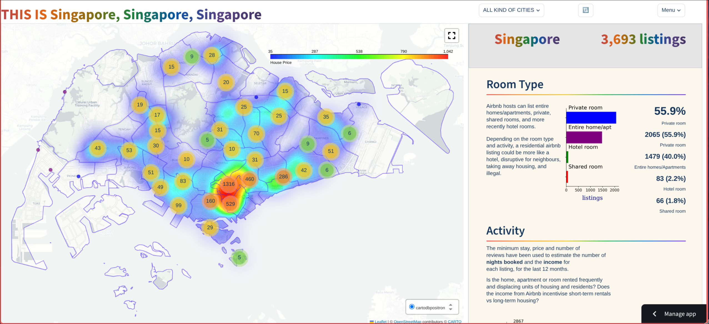
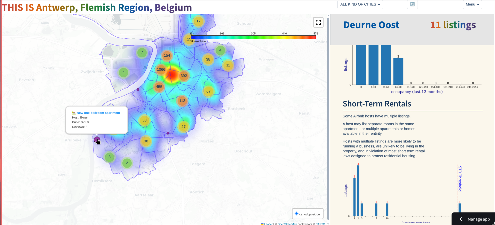
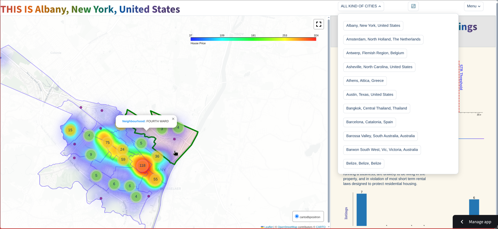

 ## This project was inspired by inside-airbnb.

<video src="https://github.com/user-attachments/assets/172bf5eb-4664-46e5-b495-524291056ae6" controls="controls" muted="muted" class="d-block rounded-bottom-2 border-top width-fit" style="max-height:640px; min-height: 200px">
</video>


## Installation and Setup
You can use this project directly at [Insight-airbnb](https://insight-airbnb-1.streamlit.app/).

To run this project locally:

### Step 1: Clone the repository

```bash
git clone https://github.com/limlim12-blip/Insight-Airbnb.git
````
#### Optional Step: Get initial data

The application requires raw data for cities like Singapore, Bangkok, and Taipei to function correctly when offline. The data is expected to be organized in the `raw/<city>/<snapshot_date>` structure.

Run the following script to download and structure the initial datasets:

```bash
python src/Get_raw.py
```

### Step 2: Install dependencies

```bash
pip install -r requirements.txt
```

### Step 3: Run the application

Start the Streamlit application from the project root directory:

```bash
streamlit run src/app/main.py
```
### Preview:
* `High-level distribution and property types`

* `Localized metrics and occupancy`

* `Navigation and UI interactivity`



